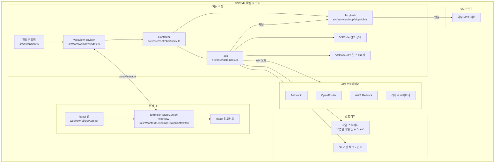

# Cline 확장 아키텍처 및 개발 가이드

## 프로젝트 개요

Cline은 핵심 확장 백엔드와 React 기반 웹뷰 프론트엔드의 조합을 통해 AI 지원을 제공하는 VSCode 확장입니다. 확장은 TypeScript로 구축되었으며 모듈식 아키텍처 패턴을 따릅니다.

## 아키텍처 개요



## 정의

- **핵심 확장**: src 폴더 내의 모든 것, 모듈식 컴포넌트로 구성됨
- **핵심 확장 상태**: src/core/controller/index.ts의 Controller 클래스에 의해 관리되며, 확장 상태의 단일 진실 소스 역할을 합니다. 여러 유형의 영구 스토리지(전역 상태, 작업 공간 상태 및 시크릿)를 관리하고, 핵심 확장 및 웹뷰 컴포넌트 모두에 상태 배포를 처리하며, 여러 확장 인스턴스 간에 상태를 조정합니다.
- **웹뷰**: webview-ui 내의 모든 것. 사용자가 보는 모든 React 또는 뷰 및 사용자 상호 작용 컴포넌트
- **웹뷰 상태**: webview-ui/src/context/ExtensionStateContext.tsx의 ExtensionStateContext에 의해 관리되며, 컨텍스트 프로바이더 패턴을 통해 React 컴포넌트에 확장 상태에 대한 액세스를 제공합니다.

### 핵심 확장 아키텍처

핵심 확장은 명확한 계층 구조를 따릅니다:

1. **WebviewProvider** (src/core/webview/index.ts): 웹뷰 수명 주기 및 통신 관리
2. **Controller** (src/core/controller/index.ts): 웹뷰 메시지 및 작업 관리 처리
3. **Task** (src/core/task/index.ts): API 요청 및 도구 작업 실행

이 아키텍처는 명확한 관심사 분리를 제공합니다:
- WebviewProvider는 VSCode 웹뷰 통합에 중점을 둡니다
- Controller는 상태를 관리하고 작업을 조정합니다
- Task는 AI 요청 및 도구 작업의 실행을 처리합니다

### WebviewProvider 구현

`src/core/webview/index.ts`의 WebviewProvider 클래스는 다음을 담당합니다:

- 정적 세트(`activeInstances`)를 통한 여러 활성 인스턴스 관리
- 웹뷰 수명 주기 이벤트 처리 (생성, 가시성 변경, 폐기)
- 적절한 CSP 헤더로 HTML 콘텐츠 생성 구현
- 개발을 위한 Hot Module Replacement (HMR) 지원
- 웹뷰와 확장 간의 메시지 리스너 설정

WebviewProvider는 Controller에 대한 참조를 유지하고 메시지 처리를 위임합니다. 또한 사이드바 및 탭 패널 웹뷰의 생성을 처리하여 Cline이 VSCode 내의 다른 컨텍스트에서 사용될 수 있도록 합니다.

### 핵심 확장 상태

`Controller` 클래스는 여러 유형의 영구 스토리지를 관리합니다:

- **전역 상태:** 모든 VSCode 인스턴스에 걸쳐 저장됩니다. 전역적으로 유지되어야 하는 설정 및 데이터에 사용됩니다.
- **작업 공간 상태:** 현재 작업 공간에 특정합니다. 작업별 데이터 및 설정에 사용됩니다.
- **시크릿:** API 키와 같은 민감한 정보를 위한 보안 스토리지.

`Controller`는 핵심 확장 및 웹뷰 컴포넌트 모두에 상태 배포를 처리합니다. 또한 여러 확장 인스턴스 간에 상태를 조정하여 일관성을 보장합니다.

인스턴스 간 상태 동기화는 다음을 통해 처리됩니다:
- 작업 히스토리 및 대화 데이터를 위한 파일 기반 스토리지
- 설정 및 구성을 위한 VSCode의 전역 상태 API
- 민감한 정보를 위한 시크릿 스토리지
- 파일 변경 및 구성 업데이트를 위한 이벤트 리스너

Controller는 다음을 위한 메서드를 구현합니다:
- 작업 상태 저장 및 로드
- API 구성 관리
- 사용자 인증 처리
- MCP 서버 연결 조정
- 작업 히스토리 및 체크포인트 관리

### 웹뷰 상태

`webview-ui/src/context/ExtensionStateContext.tsx`의 `ExtensionStateContext`는 React 컴포넌트에 확장 상태에 대한 액세스를 제공합니다. 컨텍스트 프로바이더 패턴을 사용하고 UI 컴포넌트를 위한 로컬 상태를 유지합니다. 컨텍스트에는 다음이 포함됩니다:

- 확장 버전
- 메시지
- 작업 히스토리
- 테마
- API 구성
- MCP 서버
- 마켓플레이스 카탈로그
- 작업 공간 파일 경로

VSCode의 메시지 전달 시스템을 통해 핵심 확장과 동기화하고 사용자 정의 훅(`useExtensionState`)을 통해 상태에 대한 타입 안전 액세스를 제공합니다.

ExtensionStateContext는 다음을 처리합니다:
- 메시지 이벤트를 통한 실시간 업데이트
- 스트리밍 콘텐츠를 위한 부분 메시지 업데이트
- setter 메서드를 통한 상태 수정
- 사용자 정의 훅을 통한 상태에 대한 타입 안전 액세스

## API 프로바이더 시스템

Cline은 모듈식 API 프로바이더 시스템을 통해 여러 AI 프로바이더를 지원합니다. 각 프로바이더는 `src/api/providers/` 디렉토리에 별도의 모듈로 구현되며 공통 인터페이스를 따릅니다.

### API 프로바이더 아키텍처

API 시스템은 다음으로 구성됩니다:

1. **API 핸들러**: `src/api/providers/`의 프로바이더별 구현
2. **API 변환기**: `src/api/transform/`의 스트림 변환 유틸리티
3. **API 구성**: API 키 및 엔드포인트에 대한 사용자 설정
4. **API 팩토리**: 적절한 핸들러를 생성하는 빌더 함수

주요 프로바이더는 다음과 같습니다:
- **Anthropic**: Claude 모델과의 직접 통합
- **OpenRouter**: 여러 모델 프로바이더를 지원하는 메타 프로바이더
- **AWS Bedrock**: Amazon의 AI 서비스와의 통합
- **Gemini**: Google의 AI 모델
- **Cerebras**: Llama, Qwen 및 DeepSeek 모델을 사용한 고성능 추론
- **Ollama**: 로컬 모델 호스팅
- **LM Studio**: 로컬 모델 호스팅
- **VSCode LM**: VSCode의 내장 언어 모델

### API 구성 관리

API 구성은 안전하게 저장됩니다:
- API 키는 VSCode의 시크릿 스토리지에 저장됩니다
- 모델 선택 및 비민감 설정은 전역 상태에 저장됩니다
- Controller는 프로바이더 간 전환 및 구성 업데이트를 관리합니다

시스템은 다음을 지원합니다:
- API 키의 보안 스토리지
- 모델 선택 및 구성
- 자동 재시도 및 오류 처리
- 토큰 사용 추적 및 비용 계산
- 컨텍스트 윈도우 관리

### Plan/Act 모드 API 구성

Cline은 Plan 및 Act 모드에 대한 별도의 모델 구성을 지원합니다:
- 계획과 실행에 다른 모델을 사용할 수 있습니다
- 시스템은 모드를 전환할 때 모델 선택을 보존합니다
- Controller는 모드 간 전환을 처리하고 그에 따라 API 구성을 업데이트합니다

## 작업 실행 시스템

Task 클래스는 AI 요청 및 도구 작업 실행을 담당합니다. 각 작업은 Task 클래스의 자체 인스턴스에서 실행되어 격리 및 적절한 상태 관리를 보장합니다.

### 작업 실행 루프

핵심 작업 실행 루프는 다음 패턴을 따릅니다:

```typescript
class Task {
  async initiateTaskLoop(userContent: UserContent, isNewTask: boolean) {
    while (!this.abort) {
      // 1. API 요청 및 스트림 응답
      const stream = this.attemptApiRequest()
      
      // 2. 콘텐츠 블록 파싱 및 표시
      for await (const chunk of stream) {
        switch (chunk.type) {
          case "text":
            // 콘텐츠 블록으로 파싱
            this.assistantMessageContent = parseAssistantMessageV2(chunk.text)
            // 사용자에게 블록 표시
            await this.presentAssistantMessage()
            break
        }
      }
      
      // 3. 도구 실행 완료 대기
      await pWaitFor(() => this.userMessageContentReady)
      
      // 4. 도구 결과로 루프 계속
      const recDidEndLoop = await this.recursivelyMakeClineRequests(
        this.userMessageContent
      )
    }
  }
}
```

### 메시지 스트리밍 시스템

스트리밍 시스템은 실시간 업데이트 및 부분 콘텐츠를 처리합니다:

```typescript
class Task {
  async presentAssistantMessage() {
    // 경쟁 조건을 방지하기 위해 스트리밍 잠금 처리
    if (this.presentAssistantMessageLocked) {
      this.presentAssistantMessageHasPendingUpdates = true
      return
    }
    this.presentAssistantMessageLocked = true

    // 현재 콘텐츠 블록 표시
    const block = this.assistantMessageContent[this.currentStreamingContentIndex]
    
    // 다양한 유형의 콘텐츠 처리
    switch (block.type) {
      case "text":
        await this.say("text", content, undefined, block.partial)
        break
      case "tool_use":
        // 도구 실행 처리
        break
    }

    // 완료되면 다음 블록으로 이동
    if (!block.partial) {
      this.currentStreamingContentIndex++
    }
  }
}
```

### 도구 실행 흐름

도구는 엄격한 실행 패턴을 따릅니다:

```typescript
class Task {
  async executeToolWithApproval(block: ToolBlock) {
    // 1. 자동 승인 설정 확인
    if (this.shouldAutoApproveTool(block.name)) {
      await this.say("tool", message)
      this.consecutiveAutoApprovedRequestsCount++
    } else {
      // 2. 사용자 승인 요청
      const didApprove = await askApproval("tool", message)
      if (!didApprove) {
        this.didRejectTool = true
        return
      }
    }

    // 3. 도구 실행
    const result = await this.executeTool(block)

    // 4. 체크포인트 저장
    await this.saveCheckpoint()

    // 5. API에 결과 반환
    return result
  }
}
```

### 오류 처리 및 복구

시스템에는 강력한 오류 처리가 포함됩니다:

```typescript
class Task {
  async handleError(action: string, error: Error) {
    // 1. 작업이 중단되었는지 확인
    if (this.abandoned) return
    
    // 2. 오류 메시지 형식 지정
    const errorString = `Error ${action}: ${error.message}`
    
    // 3. 사용자에게 오류 표시
    await this.say("error", errorString)
    
    // 4. 도구 결과에 오류 추가
    pushToolResult(formatResponse.toolError(errorString))
    
    // 5. 리소스 정리
    await this.diffViewProvider.revertChanges()
    await this.browserSession.closeBrowser()
  }
}
```

## Plan/Act 모드 시스템

Cline은 계획과 실행을 분리하는 이중 모드 시스템을 구현합니다:

### 모드 아키텍처

Plan/Act 모드 시스템은 다음으로 구성됩니다:

1. **모드 상태**: Controller 상태의 `chatSettings.mode`에 저장됨
2. **모드 전환**: Controller의 `togglePlanActModeWithChatSettings`에 의해 처리됨
3. **모드별 모델**: 각 모드에 대해 다른 모델을 사용하는 선택적 구성
4. **모드별 프롬프팅**: 계획과 실행을 위한 다른 시스템 프롬프트

### 모드 전환 프로세스

모드 간 전환 시:

1. 현재 모델 구성이 모드별 상태에 저장됩니다
2. 이전 모드의 모델 구성이 복원됩니다
3. Task 인스턴스가 새 모드로 업데이트됩니다
4. 웹뷰에 모드 변경이 알려집니다
5. 분석을 위한 원격 측정 이벤트가 캡처됩니다

### Plan 모드

Plan 모드는 다음을 위해 설계되었습니다:
- 정보 수집 및 컨텍스트 구축
- 명확한 질문하기
- 상세한 실행 계획 생성
- 사용자와 접근 방식 논의

Plan 모드에서 AI는 `plan_mode_respond` 도구를 사용하여 작업을 실행하지 않고 대화형 계획에 참여합니다.

### Act 모드

Act 모드는 다음을 위해 설계되었습니다:
- 계획된 작업 실행
- 파일 수정, 명령 실행 등을 위한 도구 사용
- 솔루션 구현
- 결과 및 완료 피드백 제공

Act 모드에서 AI는 `plan_mode_respond`를 제외한 모든 도구에 액세스할 수 있으며 토론보다는 구현에 중점을 둡니다.

## MCP (Model Context Protocol) 통합

### MCP 아키텍처

MCP 시스템은 다음으로 구성됩니다:

1. **McpHub 클래스**: `src/services/mcp/McpHub.ts`의 중앙 관리자
2. **MCP 연결**: 외부 MCP 서버에 대한 연결 관리
3. **MCP 설정**: JSON 파일에 저장된 구성
4. **MCP 마켓플레이스**: 사용 가능한 MCP 서버의 온라인 카탈로그
5. **MCP 도구 및 리소스**: 연결된 서버에 의해 노출된 기능

McpHub 클래스는:
- MCP 서버 연결의 수명 주기 관리
- 설정 파일을 통한 서버 구성 처리
- 도구 호출 및 리소스 액세스를 위한 메서드 제공
- MCP 도구에 대한 자동 승인 설정 구현
- 서버 상태 모니터링 및 재연결 처리

### MCP 서버 유형

Cline은 두 가지 유형의 MCP 서버 연결을 지원합니다:
- **Stdio**: 표준 I/O를 통해 통신하는 명령줄 기반 서버
- **SSE**: Server-Sent Events를 통해 통신하는 HTTP 기반 서버

## 결론

이 가이드는 상태 관리, 데이터 지속성 및 코드 구성에 특히 중점을 두고 Cline 확장 아키텍처에 대한 포괄적인 개요를 제공합니다. 이러한 패턴을 따르면 확장의 컴포넌트 전반에 걸쳐 적절한 상태 처리를 통해 강력한 기능 구현을 보장합니다.

기억하세요:
- 항상 확장에서 중요한 상태를 유지하세요
- 핵심 확장은 WebviewProvider -> Controller -> Task 흐름을 따릅니다
- 모든 상태 및 메시지에 적절한 타이핑 사용
- 오류 및 엣지 케이스 처리
- 웹뷰 재로드 전반에 걸쳐 상태 지속성 테스트
- 일관성을 위해 확립된 패턴 따르기
- 적절한 디렉토리에 새 코드 배치
- 명확한 관심사 분리 유지
- 올바른 package.json에 종속성 설치

## 기여

Cline 확장에 대한 기여를 환영합니다! 다음 가이드라인을 따르세요:

새로운 도구 또는 API 프로바이더를 추가할 때는 각각 `src/integrations/` 및 `src/api/providers/` 디렉토리의 기존 패턴을 따르세요. 코드가 잘 문서화되어 있고 적절한 오류 처리가 포함되어 있는지 확인하세요.

`.clineignore` 파일을 사용하면 사용자가 Cline이 액세스하지 않아야 하는 파일 및 디렉토리를 지정할 수 있습니다. 새로운 기능을 구현할 때 `.clineignore` 규칙을 존중하고 코드가 무시된 파일을 읽거나 수정하려고 시도하지 않는지 확인하세요.
