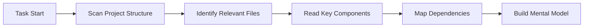

<Info>
**빠른 참고**

- **컨텍스트** = Cline이 프로젝트에 대해 알고 있는 모든 정보
- **컨텍스트 창** = Cline이 한 번에 처리할 수 있는 최대 정보량(모델마다 다름)
- **토큰** = 텍스트 측정 단위(영어 단어 약 3/4)
- **자동 관리** = Cline이 Focus Chain과 Auto Compact를 통해 컨텍스트를 자동으로 처리
</Info>

## 컨텍스트 관리란?

컨텍스트 관리는 대화 전체에서 Cline이 프로젝트에 대한 이해를 유지하는 방식입니다. 이는 당신과 Cline 사이의 공유 메모리로, 코드, 결정사항, 요구사항, 진행 상황을 담고 있습니다.

<Frame caption="컨텍스트는 Cline이 프로젝트에 대한 이해를 구축하는 공유 작업 공간과 같습니다">
	
</Frame>

### 컨텍스트의 세 가지 층

1. **즉시 컨텍스트** - 현재 대화와 활성 파일
2. **프로젝트 컨텍스트** - 코드베이스, 구조, 패턴
3. **지속 컨텍스트** - Memory Bank, .clinerules, 문서

## 컨텍스트 창 이해하기

모든 AI 모델에는 **컨텍스트 창**이 있습니다. 이는 단일 대화에서 처리할 수 있는 최대 정보량이며 토큰 단위로 측정합니다:

### 모델별 토큰 한도

| Model | Context Window | Effective Limit* | Best For |
|-------|---------------|-----------------|----------|
| **Claude 3.5 Sonnet** | 200,000 tokens | 150,000 tokens | 복잡한 작업, 대규모 코드베이스 |
| **Claude 3.5 Haiku** | 200,000 tokens | 150,000 tokens | 빠른 응답, 단순 작업 |
| **GPT-4o** | 128,000 tokens | 100,000 tokens | 범용 개발 |
| **Gemini 2.0 Flash** | 1,000,000+ tokens | 400,000 tokens | 매우 큰 컨텍스트 |
| **DeepSeek v3** | 64,000 tokens | 50,000 tokens | 비용 효율적 코딩 |
| **Qwen 2.5 Coder** | 128,000 tokens | 100,000 tokens | 전문 코딩 작업 |

*효과적 한도는 최적 성능을 위해 최대치의 약 75~80%

<Tip>
**토큰 계산을 쉽게**
- 1 토큰 ≈ 영어 단어 3/4
- 100 토큰 ≈ 75단어 ≈ 코드 3~5줄
- 10,000 토큰 ≈ 7,500단어 ≈ 텍스트 약 15페이지
- 일반적인 소스 파일: 500~2,000 토큰
</Tip>

## Cline이 컨텍스트를 구축하는 방식

효과적인 컨텍스트 구축은 Cline을 진정으로 유용하게 만드는 핵심입니다. 작업을 시작하면 Cline은 단순히 정보를 기다리지 않고 프로젝트에 대한 컨텍스트를 적극적으로 수집하며, 필요할 때는 추가 질문을 하고, 실시간으로 진행되는 상황에 맞춰 적응합니다. 이러한 자동 탐색, 사용자 안내, 동적 적응의 조합을 통해 Cline은 문제를 효과적으로 해결하는 데 필요한 정보를 항상 확보합니다.

### 1. 자동 컨텍스트 수집

작업을 시작하면 Cline은 다음을 선제적으로 수행합니다:

**Cline이 자동으로 파악하는 내용:**
- 프로젝트 구조와 파일 구성
- import 관계와 의존성
- 코드 패턴과 규칙
- 설정 파일과 구성
- 최근 변경 사항과 git 기록(@git 사용 시)

### 2. 사용자 주도 컨텍스트

자동 탐색이 상당 부분을 처리하지만, 무엇에 집중할지는 사용자가 조절할 수 있습니다. 더 구체적이고 관련성이 높은 컨텍스트를 제공할수록 Cline은 요구사항을 더 잘 이해하고 정확한 결과를 제공할 수 있습니다.

컨텍스트를 강화하는 방법:
- **@ 멘션**으로 파일, 폴더, URL 지정
- 자연어로 **요구사항 제공**
- UI 맥락을 위한 **스크린샷 공유**
- .clinerules 또는 Memory Bank로 **문서 추가**
- Cline이 추가 질문할 때 **답변 제공**

### 3. 동적 컨텍스트 적응

Cline은 대화 중에 컨텍스트를 동적으로 조정합니다. 요청의 복잡도, 남은 컨텍스트 창 여유, 현재 작업 진행도, 오류 메시지와 피드백, 대화 중 결정된 사항을 고려해 각 단계에서 가장 중요한 정보가 무엇인지 판단합니다.

## 컨텍스트 창 진행 막대

실시간으로 컨텍스트 사용량을 확인하세요:

<Frame caption="컨텍스트 창 막대는 입력/출력 토큰 사용량을 표시합니다">
	
</Frame>

### 지표 이해하기

- ⬆️ **입력 토큰**: 모델에 전달된 정보(사용자 메시지 + 컨텍스트)
- ⬇️ **출력 토큰**: 모델의 응답 및 생성된 코드
- ➡️ **캐시 토큰**: 이전에 처리한 토큰을 재사용(비용 절감 및 속도 향상)
- **진행 막대**: 사용량의 시각적 표현
- **백분율**: 전체 용량 대비 현재 사용량

## 자동 컨텍스트 관리 기능

Cline에는 컨텍스트를 처리해 주는 지능형 시스템이 포함되어 있습니다:

### Focus Chain (기본값: ON)

Focus Chain은 자동 todo 목록을 통해 작업 연속성을 유지합니다. 작업을 시작하면 Cline이 실행 가능한 단계를 생성하고 진행에 따라 업데이트합니다. Auto Compact가 실행된 후에도 핵심 컨텍스트가 유지되므로 전체 대화를 스크롤하지 않고도 진행 상황을 추적할 수 있습니다.

[자세히 보기 →](/features/focus-chain)

### Auto Compact (항상 ON)

컨텍스트 사용량이 약 80%에 도달하면 Auto Compact가 대화를 포괄적으로 요약해 줍니다. 이는 모든 결정과 코드 변경을 보존하면서 계속 작업할 수 있도록 공간을 확보합니다. 이때 메시지가 표시됩니다. 작업은 끊김 없이 이어지며, 사용자가 따로 할 일은 없습니다.

[자세히 보기 →](/features/auto-compact)

### 컨텍스트 절단 시스템

Auto Compact가 실행되기 전에 대화가 모델의 컨텍스트 창 한도에 접근하면, Cline의 Context Manager가 오류를 방지하기 위해 이전 대화의 일부를 자동으로 절단합니다.

시스템은 다음을 우선합니다:
- 원래 작업 설명 유지
- 최근 도구 실행과 결과 유지
- 현재 코드 상태와 활성 오류 보존
- 사용자-어시스턴트 메시지의 논리 흐름 유지

먼저 제거되는 항목:
- 작업 초반의 중복 대화 기록
- 더 이상 관련 없는 완료된 도구 출력
- 중간 디버깅 단계
- 역할을 마친 장황한 설명

이 과정은 자동으로 이루어집니다. 방해 없이 계속 작업할 수 있고, Cline은 문제 해결에 필요한 충분한 컨텍스트를 유지합니다.

## 모범 사례

- **구체적으로** - 명확한 목표가 Cline의 이해를 돕습니다
- **@ 멘션을 전략적으로 사용** - 전체 폴더보다 특정 파일을 참조하세요
- **진행 막대 모니터링** - 노란색/빨간색이면 `/smol` 또는 `/newtask`를 고려하세요
- **자동 관리를 신뢰** - Focus Chain과 Auto Compact가 복잡성을 자동으로 처리합니다
- **Memory Bank 사용** - 지속적인 패턴과 규칙을 문서화하세요

## 다음 단계

<CardGroup cols={2}>
	<Card title="Focus Chain" icon="link" href="/features/focus-chain">
		Focus Chain이 작업 연속성을 유지하는 방법
	</Card>
	<Card title="Auto Compact" icon="compress" href="/features/auto-compact">
		자동 대화 압축 이해하기
	</Card>
	<Card title="Memory Bank" icon="brain" href="/prompting/cline-memory-bank">
		지속적인 프로젝트 지식 설정
	</Card>
	<Card title="Cline Rules" icon="gavel" href="/features/cline-rules">
		프로젝트 전용 규칙 정의
	</Card>
</CardGroup>
