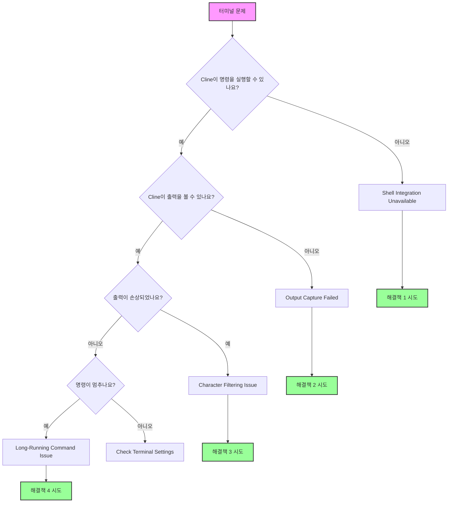

이 가이드는 Cline의 터미널 통합 문제를 해결하는 데 도움이 됩니다. 터미널 통합은 Cline이 명령을 실행하고 출력 결과를 읽어 오류, 테스트 결과, 응답을 이해하는 데 필수입니다.

## 먼저 시도할 것: 백그라운드 실행 모드

터미널 문제의 가장 간단한 해결책은 **Background Execution Mode**로 전환하는 것입니다:

1. **Settings** 클릭(Cline 채팅 오른쪽 상단)
2. **Terminal Settings**로 이동
3. **Terminal Execution Mode** → **Background Exec**로 설정

이 모드는 VSCode 통합 터미널 대신 백그라운드 프로세스에서 명령을 실행하므로 대부분의 통합 문제를 우회합니다. 아래 가이드는 VSCode 통합 터미널이 꼭 필요한 사용자를 위한 내용입니다.

---

## 빠른 진단 흐름도

다음 흐름도를 따라 문제를 빠르게 식별하세요:



## 일반적인 문제와 빠른 해결책

### 1. Shell Integration Unavailable

**증상:**

-   메시지: "Shell Integration Unavailable"
-   명령은 실행되지만 Cline이 출력을 읽지 못함
-   수동 터미널은 정상 동작하지만 Cline과 연동되지 않음

**빠른 해결책:**

#### macOS

-   **bash로 전환**

    1. Cline Settings로 이동
    2. **"Terminal Settings"** 탭 클릭
    3. **"Default Terminal Profile"**에서 **"bash"** 선택

-   **Oh-My-Zsh 임시 비활성화**:

    1. zsh 사용 중이면 터미널에 `mv ~/.zshrc ~/.zshrc.backup` 입력
    2. VSCode 재시작

-   **환경 설정**:
    1.a Zsh 사용자는 아래 중 하나로 프로필 편집:

          - `nano ~/.zshrc`
          - `vim ~/.zshrc`
          - `code ~/.zshrc`

    1.b Bash 사용자는:

          - `nano ~/.bash_profile`

    2. 셸 설정에 추가: `export TERM=xterm-256color`
    3. 저장

#### Windows

-   **PowerShell 7 사용**

    1. Microsoft Store에서 설치
    2. Cline Settings로 이동
    3. **"Terminal Settings"** 탭 클릭
    4. **"Default Terminal Profile"**에서 **"PowerShell 7"** 선택

-   **Windows ConPTY 비활성화**

    1. VSCode Settings로 이동
    2. Settings 검색창에 "Integrated: Windows Enable Conpty" 입력
    3. 옵션 체크 해제

-   **Command Prompt 시도**
    1. Cline Settings로 이동
    2. **"Terminal Settings"** 탭 클릭
    3. **"Default Terminal Profile"**에서 **"Command Prompt"** 선택

#### Linux

-   **bash 사용**

    1. Cline Settings로 이동
    2. **"Terminal Settings"** 탭 클릭
    3. **"Default Terminal Profile"**에서 **"bash"** 선택

-   **권한 확인**

    1. VSCode에 터미널 접근 권한이 있는지 확인

-   **커스텀 프롬프트 비활성화**
    1. `.bashrc`에서 프롬프트 커스터마이징을 주석 처리

### 2. 명령 출력이 보이지 않음

**증상:**

-   Cline 채팅에 "[Command is running but producing no output]" 표시
-   명령은 완료되지만 Cline이 결과를 보지 못함
-   간헐적으로만 동작

**해결책:**

-   **Shell Integration Timeout 증가**

    1. Cline 채팅 오른쪽 상단의 **Settings** 클릭
    2. **Settings** 창에서 왼쪽의 **"Terminal Settings"** 탭 클릭
    3. "Shell integration timeout (seconds)"에 **"10"** 입력

-   **Terminal Reuse 비활성화**

    1. Cline 채팅 오른쪽 상단의 **Settings** 클릭
    2. **Settings** 창에서 왼쪽의 **"Terminal Settings"** 탭 클릭
    3. **"Enable aggressive terminal reuse"** 옵션을 **해제**

-   **간섭 확장 확인**
    1. 터미널 관련 VSCode 확장을 비활성화

### 3. 문자 필터링 문제

**증상:**

-   출력에서 쉼표가 사라짐(JSON이 손상된 것처럼 보임)
-   특수 문자가 출력에서 제거됨
-   수동 실행 시에는 없는 구문 오류 발생

**해결책:**
이 문제는 출력 처리의 알려진 버그입니다. 다음 우회 방법을 사용하세요:

-   AI에게 파일 출력 사용 권장
    1. Cline 채팅이나 Cline rules에 `command > output.txt`로 출력한 뒤 파일을 읽도록 지시

<Tip>
	이 문제군은 최신 Cline 버전에서 부분적으로만 해결되었습니다. 계속 문제가 발생하면 GitHub 이슈를 등록하세요.
</Tip>

### 4. 장시간 실행 명령 & 진행 바

**증상:**

-   Docker 빌드가 Cline에서 끝나지 않음
-   진행 바가 수천 토큰을 소모
-   Cline 버튼 "Proceed while running"이 제대로 동작하지 않음

<Tip>
	이 문제군은 최신 Cline 버전에서 해결되었습니다. 그래도 문제가 있다면 GitHub 이슈를 등록하세요.
</Tip>

## 터미널 설정 설명

Cline 설정 아이콘을 클릭하고 "Terminal Settings" 섹션에서 접근하세요:

### Default Terminal Profile

-   **역할**: Cline이 사용할 셸을 선택
-   **변경 시점**: 기본 셸에서 통합 문제가 있을 때
-   **권장**: - macOS: bash (zsh에서 문제가 있을 때) - Windows: PowerShell 7 - Linux: bash

### Shell Integration Timeout

-   **역할**: 터미널이 준비될 때까지 기다리는 시간
-   **기본값**: 4초
-   **늘려야 할 때**:
    -   셸 시작이 느림(무거운 .zshrc/.bashrc)
    -   WSL 환경
    -   SSH 연결
-   **권장**: - 문제가 있으면 10초로 시작

### Enable Aggressive Terminal Reuse

-   **역할**: 디렉터리가 다르더라도 기존 터미널 재사용
-   **비활성화해야 할 때**:
    -   명령이 잘못된 디렉터리에서 실행됨
    -   가상 환경 문제
    -   터미널 상태 손상
-   **트레이드오프**: - 비활성화 시 더 많은 터미널이 생성되지만 상태가 깨끗하게 유지됨

### Terminal Output Line Limit

-   **역할**: Cline이 읽는 터미널 출력 줄 수 제한
-   **기본값**: 500줄
-   **조정 시점**:
    -   빌드 출력이 길면 증가
    -   토큰 제한에 걸리면 감소
    -   진행 바가 있는 명령은 100으로 설정

## 플랫폼별 해결책

### macOS 문제

#### Oh-My-Zsh 충돌

Oh-My-Zsh는 셸 통합을 방해하는 경우가 많습니다. 해결책:

1. VSCode용 최소 `.zshrc` 생성:
    ```bash
    # ~/.zshrc-vscode
    export TERM=xterm-256color
    export PAGER=cat
    # 최소 PATH 및 환경 설정
    ```
2. VSCode에 적용:
    ```json
    {
    	"terminal.integrated.env.osx": {
    		"ZDOTDIR": "~/.zshrc-vscode"
    	}
    }
    ```

#### macOS 15+ 문제

최근 macOS는 터미널 권한이 더 엄격합니다:

1. System Preferences → Privacy & Security → Developer Tools
2. Visual Studio Code 추가
3. VSCode 완전 재시작

### Windows 문제

이전 단계로도 해결되지 않는다면 Git Bash(또는 PowerShell) 사용을 권장합니다.

### Git Bash

Git Bash는 Windows에서 유닉스 계열 명령줄 환경을 제공하는 터미널 에뮬레이터입니다. 사용 방법:

1. [https://git-scm.com/downloads/win](https://git-scm.com/downloads/win)에서 Git for Windows 설치
2. VSCode 종료 후 재실행
3. `Ctrl + Shift + P`로 Command Palette 열기
4. "Terminal: Select Default Profile" 입력 후 선택
5. "Git Bash" 선택

### PowerShell

PowerShell을 사용하려면 최소 v7 이상인지 확인하세요.
  - 현재 버전 확인: `$PSVersionTable.PSVersion`
  - 7 미만이면 [PowerShell 업데이트](https://learn.microsoft.com/en-us/powershell/scripting/whats-new/migrating-from-windows-powershell-51-to-powershell-7?view=powershell-7.4#installing-powershell-7)

PowerShell은 기본적으로 스크립트 실행을 제한하므로 실행 정책을 조정해야 할 수 있습니다.

#### PowerShell 실행 정책 이해하기

PowerShell은 실행 정책으로 어떤 스크립트를 실행할지 결정합니다. 주요 정책:

- `Restricted`: 스크립트 실행 불가(기본값)
- `AllSigned`: 모든 스크립트가 신뢰된 게시자의 서명 필요
- `RemoteSigned`: 로컬 스크립트는 실행 가능, 인터넷에서 받은 스크립트는 서명 필요
- `Unrestricted`: 제한 없음. 인터넷에서 받은 스크립트 실행 전 경고 표시

VSCode 개발 환경에서는 `RemoteSigned`가 일반적으로 권장됩니다. 로컬 스크립트를 허용하면서 다운로드 스크립트의 보안을 유지합니다. 실행 정책과 보안 영향에 대한 자세한 내용은 Microsoft 문서 [About Execution Policies](https://learn.microsoft.com/en-us/powershell/module/microsoft.powershell.core/about/about_execution_policies)를 참고하세요.

#### 실행 정책 변경 단계

1. PowerShell을 관리자 권한으로 실행: `Win + X` → "Windows PowerShell (Administrator)" 또는 "Windows Terminal (Administrator)".

2. 현재 실행 정책 확인:
     ```powershell
     Get-ExecutionPolicy
     ```
   - 출력이 `RemoteSigned`, `Unrestricted`, `Bypass`면 변경이 필요 없을 수 있습니다.
   - 출력이 `Restricted` 또는 `AllSigned`면 shell integration을 위해 변경이 필요할 수 있습니다.

3. 실행 정책 변경:
     ```powershell
     Set-ExecutionPolicy RemoteSigned -Scope CurrentUser
     ```
   - 현재 사용자만 변경하므로 시스템 전체 변경보다 안전합니다.

4. 프롬프트가 나오면 `Y` 입력 후 Enter.

5. `Get-ExecutionPolicy`로 변경 확인.

6. VSCode 재시작 후 shell integration 다시 시도.


#### WSL 통합

WSL 문제 해결:

1. VSCode용 WSL 확장 사용
2. WSL 터미널에서 `code .`로 폴더 열기
3. Cline에서 터미널 프로필로 "WSL Bash" 선택

#### 경로 문제

Windows 경로 문제 해결:

1. Cline에서 슬래시 사용: `C:/Users/...`
2. 공백 경로는 따옴표로 감싸기: `"C:/Program Files/..."`
3. `~` 사용 지양 - 전체 경로 사용

### Linux/SSH/컨테이너 문제

#### SSH 연결

원격 개발 시:

1. 로컬이 아니라 원격 머신에 Cline 설치
2. SSH 확장의 통합 터미널 사용
3. 타임아웃을 15초 이상으로 증가

#### Docker 컨테이너

컨테이너에서 개발할 때:

1. 컨테이너 내부에 Cline 설치
2. Dev Containers 확장 사용
3. 셸 통합 스크립트가 존재하는지 확인

## 셸별 해결책

### Zsh

```bash
# ~/.zshrc에 추가
export TERM=xterm-256color
export PAGER=cat
# VSCode에서는 간단한 프롬프트 사용
if [[ "$TERM_PROGRAM" == "vscode" ]]; then
    PS1="%n@%m %1~ %# "
fi
```

### Bash

```bash
# ~/.bashrc에 추가
export TERM=xterm-256color
export PAGER=cat
# VSCode용 간단한 프롬프트
if [[ "$TERM_PROGRAM" == "vscode" ]]; then
    PS1='\u@\h:\w\$ '
fi
```

### Fish

```fish
# ~/.config/fish/config.fish에 추가
set -x TERM xterm-256color
set -x PAGER cat
# VSCode에서 화려한 기능 비활성화
if test "$TERM_PROGRAM" = "vscode"
    function fish_prompt
        echo (whoami)'@'(hostname)':'(pwd)'> '
    end
end
```

### PowerShell

```powershell
# $PROFILE에 추가
$env:PAGER = "cat"
# 진행 바 비활성화
$ProgressPreference = 'SilentlyContinue'
```

## 고급 문제 해결

### 디버그 모드

터미널 디버깅을 활성화해 내부 동작을 확인하세요:

1. VSCode Command Palette 열기(Cmd/Ctrl+Shift+P)
2. "Developer: Set Log Level..." 실행
3. "Trace" 선택
4. Output 패널 → "Cline"에서 터미널 로그 확인
